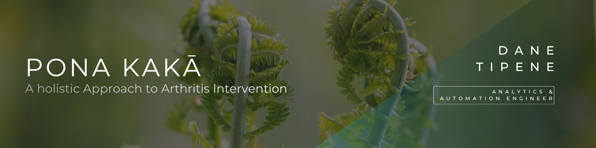

*How do you measure the impact of a health programme on a community that mainstream research tools weren't designed to serve?*

 

## Overview

The Waikare Community Development and Research Trust needed to understand whether their Pona Kakā initiative was working — and why. The programme provided holistic, culturally grounded arthritis intervention for Māori communities, funded by the Health Research Council of New Zealand (HRCNZ). The data existed — interview transcripts, participant responses, health outcomes — but it needed someone to make sense of it in a way that respected both the numbers and the people behind them.

I conducted a mixed-methods analysis combining thematic review of qualitative interview data with quantitative descriptive statistics and visualisation. Findings were synthesised progressively — from an initial insights report delivered early to guide the Trust's decision-making, through to a final executive presentation communicating the full picture to both technical and non-technical stakeholders.

**The result:** A complete analysis of participant experiences, pain management outcomes, and programme impact — delivered in a format the Trust could use immediately to refine intervention strategies and strengthen their case for ongoing funding and programme expansion.

**Tools:** Python · Pandas · MS Excel · Qualitative Thematic Analysis · Canva

---

 

Deliverables

**1. Project Workflow Outline**  
Developed a detailed document outlining the project's objectives, proposed workflow, and key deliverables — a shared roadmap that aligned expectations between analyst and project lead before any analysis began.

**2. Qualitative Data Analysis**  
Conducted in-depth thematic review of interview transcripts to extract participant experiences, identifying key themes and converting qualitative responses into structured, quantifiable data for further analysis.

**3. Data Categorisation and Summarisation**  
Organised interview data in Excel by categorising responses into relevant themes — pain duration, treatment types, programme engagement — creating a clean, analysis-ready dataset from raw qualitative input.

**4. Initial Summary of Insights Report**  
Delivered an early-stage findings report to the project lead, summarising key themes and providing a preliminary overview to guide subsequent analysis and decision-making before the full work was complete.

**5. Quantitative Analysis with Python**  
Built and analysed a structured CSV dataset using Python — computing descriptive statistics, identifying trends, and generating visualisations that translated participant health data into clear, actionable insights.

**6. Executive Report and Presentation**  
Synthesised all qualitative and quantitative findings into a cohesive executive presentation designed in Canva — communicating the programme's impact on the Māori community in a format accessible to non-technical stakeholders and funding bodies.

> *All project materials remain confidential. Findings are unable to be shared at this time.*

---

 

*Built by [Dane Tipene](https://github.com/DataDaneHQ) · Analytics & Automation Engineer*

***License:*** *All rights reserved. No part of this repository may be reproduced, distributed, or transmitted in any form or by any means, including photocopying, recording, or other electronic or mechanical methods, without the prior written permission of the owner.*